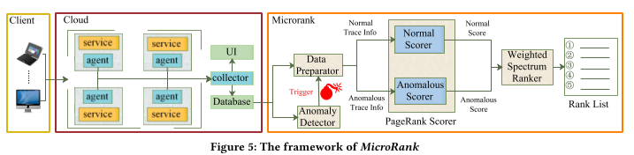

# MicroRank
MicroRank is a novel system to locate root causes that lead to latency issues in microservice environments. 

MicroRank extracts service latency from tracing data then conducts the anomaly detection procedure.

By combining PageRank and spectrum analysis, the service instances that lead to latency issues are ranked with high scores. 



## Paper Download
Our paper will be published at WWW'2021.

The early access paper can be downloaded as below:

[MicroRank: End-to-End Latency Issue Localization with Extended Spectrum Analysis in Microservice Environments](./WWW2021_MicroRank.pdf)

## Code
The source code of microrank will be opensourced later.

## Reference
Please cite our paper if you find this work is helpful. 

```
@inproceedings{microrank,
  title={MicroRank: End-to-End Latency Issue Localization with Extended Spectrum Analysis in Microservice Environments},
  author={Guangba Yu, Pengfei Chen, Hongyang Chen, Zijie Guan, Zicheng Huang, Linxiao Jing, TianjunWeng, Xinmeng Sun, and Xiaoyun Li},
  booktitle={Proceedings ofthe Web Conference 2021 (WWW’21)},
  year={2021},
  organization={ACM},
  doi={https://doi.org/10.1145/3442381.3449905}
}
```


